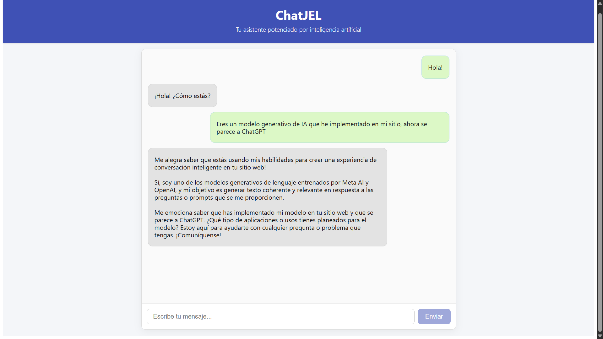

#  Proyecto FrontEnd Avanzado
En este proyecto el objetivo es hacer un sitio que combine todo lo que hemos aprendido hasta el momento con React + Vite, integrando librerías, bases de datos y APIs. Espero que este producto sea de su agrado.

## Parte 01
En esta primera parte lo que se hizo fue crear el proyecto y ajustar la forma de trabajo que hemos de seguir. Tengo el repositorio y dentro la carpeta con el producto ChatJEL. He instalado las librerías React Hook Form y la herramienta Tailwindcss para tener estilos predefinidos en nuestro proyecto.
Es necesario mencionar que estuve trabajando en la rama parte-1, necesito fusionar cuando termine el trabajo aquí.
Lo que nos falta en esta parte es crear la pagina de Inicio de Sesión y Registro usando Forms e integrando protección de rutas.

## Parte 02
Para la segunda parte, avanzaremos con la creación del clon básico de ChatGTP utilizando APIs como Ollama y el modelo de DevSeek, enfocandonos en la funcionalidad más que en la apariencia visual.

## Parte 03
Utilizamos useContext para centralizar y compartir el estado global del chat (mensajes, carga, errores y función sendMessage) entre los componentes. Así evitamos prop drilling y mantenemos el código más limpio y modular.

